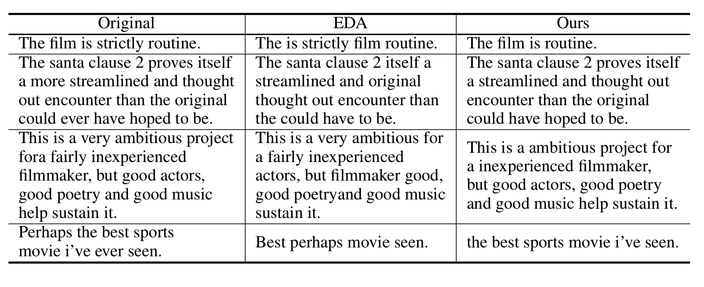

# [ICLR 2024 Tiny Papers] Adverb Is the Key: Simple Text Data Augmentation with Adverb Deletion

## Introduction

This repository contains the source code for the paper ["Adverb Is the Key: Simple Text Data Augmentation with Adverb Deletion"](https://openreview.net/pdf?id=bNxB3Yd3Pd) accepted at ICLR 2024 Tiny Papers. We propose a simple text data augmentation method based on the deletion of adverbs, which enhances the performance of text classification models by removing adverbs from the input text. We demonstrate that adverb deletion can be used as an effective data augmentation technique for various text classification tasks, such as sentiment analysis and natural language inference. Please refer to the paper for more details.



## Experiment

```shell
$ conda create -n proj-adverb python=3.8
$ conda activate proj-adverb
$ pip install torch==1.13.1+cu116 torchvision==0.14.1+cu116 torchaudio==0.13.1 --extra-index-url https://download.pytorch.org/whl/cu116
$ pip install -r requirements.txt
$ bash run_experiment.sh
```

## Citation

If you found this work helpful for your future research, please consider citing this work:

```bibtex
@inproceedings{choi2024adverb,
  title={Adverb Is the Key: Simple Text Data Augmentation with Adverb Deletion},
  author={Choi, Juhwan and Kim, YoungBin},
  booktitle={The Second Tiny Papers Track at ICLR 2024}
}
```
